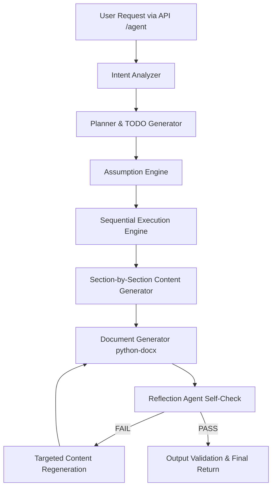

# Autonomous AI Business Document Generator

An autonomous, multi-step planning and execution agent that takes a natural language prompt, analyzes requirements, makes contextual assumptions, generates task checklists, executes content generation section-by-section, compiles a professional Word document (.docx) using `python-docx`, performs a self-reflection audit, and regenerates weak sections before returning a structured API response.

---

## Architecture Diagram & Agent Workflow



The system implements the **Plan-Execute-Reflect** loop, ensuring that the generated document undergoes a quality self-check rather than performing a simple one-shot LLM completion.

---

## Folder Structure

```
agent_project/
├── app.py                  # FastAPI Application entrypoint
├── requirements.txt        # Project package dependencies
├── .env.example            # Environment variables configuration template
├── README.md               # Extensive guide and system specifications
│
├── api/
│   └── routes.py           # FastAPI Endpoints (POST /agent, GET /health, GET /)
│
├── agent/
│   ├── planner.py          # Classifies document type, sections, and builds task list
│   ├── executor.py         # Runs sequential TODO execution and handles content generation
│   ├── reflection.py       # Audits content quality (PASS/FAIL) and gives feedback
│   ├── memory.py           # In-memory storage for active document session variables
│   ├── prompts.py          # Curated system and user prompt templates
│   └── workflow.py         # Main orchestrator running the multi-agent execution loop
│
├── llm/
│   ├── groq_client.py      # LLM clients for Groq, Gemini, Ollama, LM Studio, and Mock fallbacks
│   └── llm_factory.py      # Abstract interface and factory resolving configuration
│
├── tools/
│   ├── document_generator.py # Formats markdown into a professional styled DOCX file
│   ├── validator.py        # Verifies file integrity, file existence, and layout presence
│   ├── assumption_engine.py # Auto-generates logical business/technical contexts for prompts
│   └── timer.py            # Tracks granular action and total run durations
│
├── models/
│   ├── request.py          # Pydantic input models (validating length & content)
│   └── response.py         # Pydantic structured output models
│
├── generated_docs/         # Output directory containing generated Word files (.docx)
│
└── utils/
    ├── logger.py           # Console logger formatting step-by-step progress terminal output
    └── helpers.py          # Extraction and parsing utilities for LLM JSON outputs
```

---

## Setup & Installation

### 1. Prerequisites
- Python 3.11.x installed. (The environment utilizes `/usr/bin/python3.11` to match strict constraints).

### 2. Installation
Navigate to the project root and create a virtual environment, then install requirements:
```bash
cd agent_project
python3.11 -m venv .venv
source .venv/bin/activate
pip install -r requirements.txt
```

### 3. Environment Configuration
Copy the `.env.example` file to `.env`:
```bash
cp .env.example .env
```
Fill in the configuration details. The system prefers **Groq** or **Gemini Free** but runs locally on **Ollama** or **LM Studio** seamlessly.
If no LLM settings are supplied, the factory initializes the `MockProvider` which simulates the LLM outputs, enabling out-of-the-box pipeline validation without API keys.

---

## Running the Application

### Option A: Running the Interactive CLI Tool (Custom Queries)
To run the agent locally and input custom queries dynamically via the interactive terminal interface:
```bash
python app.py
```
This CLI will prompt you to type your request, execute the full multi-agent planning and generation in-process, and output the styled Word document under `generated_docs/`.

### Option B: Running the FastAPI Web Server
To start the FastAPI web server for API integrations:
```bash
uvicorn app:app --reload
```
By default, the server runs on `http://localhost:8000`.


---

## API Usage Examples

### Example 1: Chatbot Proposal
**Endpoint**: `POST http://localhost:8000/agent`
**Header**: `Content-Type: application/json`
**Body**:
```json
{
    "request": "Generate a project proposal for implementing an AI chatbot for customer support."
}
```

### Example 2: ERP Monolith Migration (Forcing Autonomous Assumptions)
**Endpoint**: `POST http://localhost:8000/agent`
**Header**: `Content-Type: application/json`
**Body**:
```json
{
    "request": "We need a technical implementation plan for migrating our legacy monolithic ERP to microservices in six months with a small engineering team and uncertain budget. Make reasonable assumptions."
}
```

### Example Curl Request
```bash
curl -X POST http://localhost:8000/agent \
     -H "Content-Type: application/json" \
     -d '{"request": "Generate a project proposal for implementing an AI chatbot for customer support."}'
```

### Example Output JSON
```json
{
   "status": "success",
   "summary": "This document outlines a professional Project Proposal for integrating an AI chatbot. It details milestones, resource allocation, and API integrations.",
   "execution_plan": [
      "Understand request",
      "Extract objectives",
      "Identify document type",
      "Determine required sections",
      "Create assumptions",
      "Generate outline",
      "Generate content",
      "Format document",
      "Validate document",
      "Reflect and improve"
   ],
   "completed_tasks": [
      "Understand request",
      "Extract objectives",
      "Identify document type",
      "Determine required sections",
      "Create assumptions",
      "Generate outline",
      "Generate content",
      "Format document",
      "Validate document",
      "Reflect and improve"
   ],
   "document_path": "generated_docs/project_proposal_1720516422.docx",
   "document_location": "generated_docs/project_proposal_1720516422.docx",
   "assumptions": [
      "The client uses Zendesk or Salesforce for ticket resolution.",
      "The initial phase targets text-based queries on English language channels.",
      "Security compliance is limited to standard GDPR data masking policies."
   ],
   "reflection_result": {
      "status": "PASS",
      "missing_sections": [],
      "improvements": [
         "The document outline is complete. Consider adding a KPI metric dashboard chart next quarter."
      ]
   },
   "execution_time": "12.45 seconds"
}
```

---

## Screenshots Placeholder
Below is a visual diagram mapping out where to view terminal outputs and output artifacts:
```
+-------------------------------------------------------------+
| TERMINAL WINDOW:                                            |
| Planning...                                                 |
| Creating TODO...                                            |
| Executing Task 1: Understand request...                     |
| Executing Task 2: Extract objectives...                     |
| Executing Task 3: Identify document type...                 |
| Generating DOCX...                                          |
| Running Reflection...                                       |
| Completed Successfully                                      |
+-------------------------------------------------------------+
| OUTPUT ARTIFACT:                                            |
| File saved: generated_docs/project_proposal_1720516422.docx |
+-------------------------------------------------------------+
```

---

## Design Tradeoffs & Technical Decisions

1. **State Management**: We chose an in-memory `AgentState` object. For persistent production use with millions of jobs, a Redis or PostgreSQL database state-machine (like Temporal or Celery) should track active agent sessions.
2. **Synchronous Requests**: The `POST /agent` runs synchronously. For large documents (taking >1 minute), a background task pattern returning a `task_id` with polling on `GET /tasks/{id}` is a better design. We chose synchronous execution here to match the strict single-request endpoint requirement.
3. **Mock Provider fallback**: Added to ensure the suite is instantly runnable and verifiable even without a Groq/Gemini key or a running Ollama container.

---

## Future Improvements

- **Async Task Queueing**: Run the workflow asynchronously with Celery/Redis, enabling status updates to be pushed via WebSockets to front-ends.
- **Rich Document Elements**: Inject charts, flowcharts (from Mermaid), or images using python-docx's drawing capabilities.
- **Enhanced Memory**: Introduce RAG vector databases so that the agent can read and reference existing company documentation or past generated documents.
